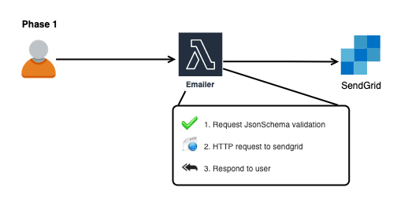
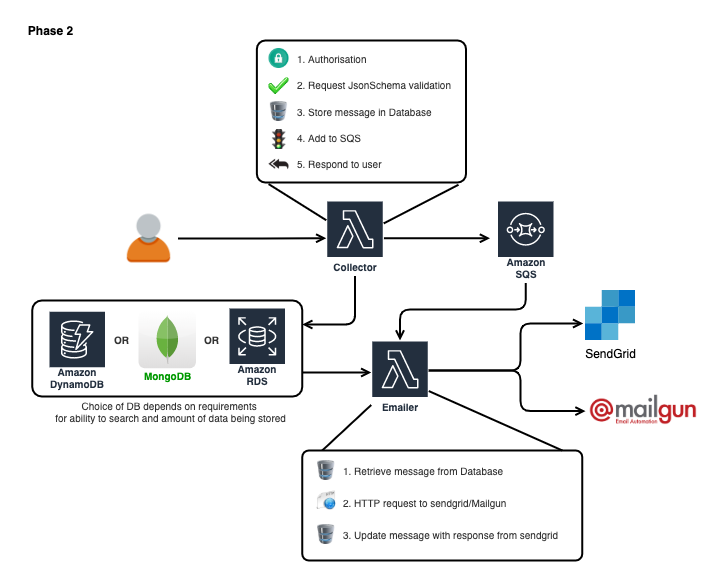

# ARCHITECTURE

## Phase 1

Phase 1 involves basic setup (proof of concept) for the idea.

### Cloud services

- Lambda
- API Gateway

### Limitations

- No authorisation
- Does not cater for 3rd party email provider's limitations
- Scheduling is not supported
- Only SendGrid support

## Phase 2

This phase involves possible implementation for scalable solution.

### Cloud services

- Lambda
- API Gateway
- SQS
- Database (one of the following)
    - DynamoDB
    - Aurora / RDS
    - MongoDB
    
### Limitations

- If email provider is chosen to be `SES` then
    - `SQS` doesn't really provide as much flexibility for scheduling
    - may need to involve 3rd party queueing mechanism (i.e. `BeeQueue`, `Bull` etc) which may need to run 24x7, 
    and can be built in `BeanStalk` application with smallest instance require and scale further  
